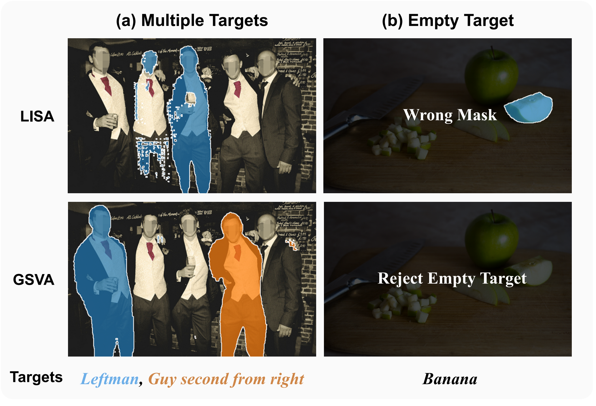
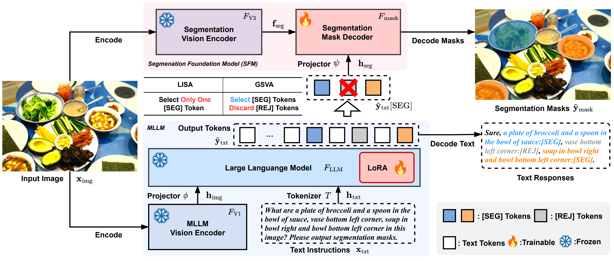

# GSVA: Reasoning Segmentation via Large Language Model

This repository contains the code for the paper GSVA: Generalized Segmentation via Multimodal Large Language Models (CVPR2024). [[arXiv](https://arxiv.org/abs/2312.10103)][[video](https://youtu.be/Ruh5MovwMj4?feature=shared)][[poster](https://cloud.tsinghua.edu.cn/f/bf8504068ff142e190c5/)][[CVPR page](https://openaccess.thecvf.com/content/CVPR2024/html/Xia_GSVA_Generalized_Segmentation_via_Multimodal_Large_Language_Models_CVPR_2024_paper.html)]


## Introduction

### Motivation



Generalized Referring Expression Segmentation (GRES) has recently been proposed to support multiple-target and empty-target cases, which are practical in real world application but omitted in classic RES tasks. GRES poses the challenges that require the model to **handle complex spatial relationships of the instances** in the image to *segment the targets at various locations* and *reject the empty targets in the wrong places*. Current segmentation MLLM focuses more on the complex referring expressions which could benefit from the LLM, however the multiple-target and empty-target challenges remain uncharted.

In this paper, we propose **Generalized Segmentation Vision Assistant (GSVA)** to address this gap. Specifically, GSVA reuses the [SEG] token to prompt the segmentation model towards supporting multiple mask references simultaneously and innovatively learns to generate a [REJ] token to reject the null targets explicitly.
<br clear="left"/>

### Method



The architecture of GSVA follows current segmentation MLLMs like LISA, which enables high-fidelity segmentation outputs by integrating two types of foundation models: (1) Multimodal Large Language Model (MLLM) as an aligned vision-language cognitive module; (2) Segmentation Foundation Model (SFM) to segment the target out of the input image based on user’s instruction. A special token [SEG] is used to prompt the SFM to follow the user instruction for desired referring segmentation outputs.

**GSVA** relax the one-to-one constraint to support multiple target outputs via learning multiple [SEG] tokens. By prompting each [SEG] token with the corresponding target expression, GSVA segments different mask for each target. For absent targets, GSVA predicts a [REJ] token to mark a rejection in the output sequence, therefore the empty target expressions are appropriately rejected.

### Visualization


More visualizations can be found in **Appendix F** of the paper.

## Code & Data Preparation

### Dependencies

```
bitsandbytes==0.43.3
deepspeed==0.15.0
einops==0.4.1
opencv-python-headless==4.10.0.84
peft==0.4.0
PyYAML==6.0.2
sentencepiece==0.2.0
termcolor==2.4.0
timm==0.6.13
tokenizers==0.19.1
torch==2.4.0+cu124
torchvision=0.19.0+cu124
transformers==4.44.2
```

### Data

We follow the [instructions in LISA](https://github.com/dvlab-research/LISA/blob/main/README.md#training-data-preparation) to prepare most of the datasets. For [gRefCOCO](https://github.com/henghuiding/gRefCOCO), we add the expressions and annotations json files into the `refer_seg` sub-directory, as shown in the tree structure below.

```
├── ade20k
├── coco
├── cocostuff
│   ├── train2017
│   └── val2017
├── llava_dataset
│   └── llava_instruct_150k.json
├── mapillary
│   ├── LICENSE
│   ├── README
│   ├── config_v1.2.json
│   ├── config_v2.0.json
│   ├── demo.py
│   ├── testing
│   ├── training
│   └── validation
├── reason_seg
│   └── ReasonSeg
├── refer_seg
│   ├── grefcoco
│   ├── images
│   ├── refclef
│   ├── refcoco
│   ├── refcoco+
│   └── refcocog
└── vlpart
    ├── paco
    └── pascal_part
```

### Pre-trained weights

#### LLaVA-vicuna-v1.1 and LLaVA-Llama2

We follow LISA with 3 variants of [LLaVA], for LLaVA-vicuna-v1.1, we apply the delta weights `liuhaotian/LLaVA-Lightning-7B-delta-v1-1` and `liuhaotian/LLaVA-13b-delta-v1-1` to llama-7b and llama-13b base weights, respectively. For LLaVA-Llama-2, we use the full weights of `liuhaotian/llava-llama-2-13b-chat-lightning-preview`. For LLaVA pretrained models, please see the instructions in [LLaVA model zoo](https://github.com/haotian-liu/LLaVA/blob/main/docs/MODEL_ZOO.md#legacy-models-delta-weights).


#### SAM

The pretrained weights of SAM can be found in [Segment Anything](https://github.com/facebookresearch/segment-anything?tab=readme-ov-file#model-checkpoints).


## Evaluation on Trained Models

### Download Model Weights

The pretrained models can be found in [OneDrive](https://1drv.ms/f/s!ApI0vb6wPqmtku1kOKbVTJkwa6jG_Q?e=vaG9Gj) and [TsinghuaCloud](https://cloud.tsinghua.edu.cn/d/1423fb16fdb9445e8155/).

### Evaluation

Modify the templates in `scripts/eval_demo.sh` with appropriate paths, then execute

```
bash scripts/eval_demo.sh
```

For example, set the `weight` argument in `scripts/eval_demo.sh` to `gsva-7b-pt.bin`, and `gsva-7b-ft-gres.bin`, then set the `val_dataset` to `grefcoco|unc|val`, `grefcoco|unc|testA`, and `grefcoco|unc|testB`, the evaluation scritps will give the following results:

```
# gsva-7b-pt.bin, grefcoco|unc|val, fp32 inference
[2024-09-08 08:04:56 default] (main.py 158): INFO Load trained weights successfully!
[2024-09-08 08:05:29 default] (main.py 205): INFO Testing with 1500 examples.
[2024-09-08 08:07:02 default] (solver.py 305): INFO [1] grefcoco giou: 0.6347, ciou: 0.6165, N_acc: 0.5698, T_acc: 0.9954.

# gsva-7b-pt.bin, grefcoco|unc|testA, fp32 inference
[2024-09-08 08:09:15 default] (main.py 158): INFO Load trained weights successfully!
[2024-09-08 08:09:47 default] (main.py 205): INFO Testing with 750 examples.
[2024-09-08 08:10:53 default] (solver.py 305): INFO [1] grefcoco giou: 0.6999, ciou: 0.6917, N_acc: 0.6339, T_acc: 0.9846.

# gsva-7b-pt.bin, grefcoco|unc|testB, fp32 inference
[2024-09-08 08:13:10 default] (main.py 158): INFO Load trained weights successfully!
[2024-09-08 08:13:41 default] (main.py 205): INFO Testing with 750 examples.
[2024-09-08 08:14:47 default] (solver.py 305): INFO [1] grefcoco giou: 0.6134, ciou: 0.6026, N_acc: 0.5868, T_acc: 0.9895.

# gsva-7b-ft-gres.bin, grefcoco|unc|val, fp32 inference
[2024-09-08 08:17:36 default] (main.py 158): INFO Load trained weights successfully!
[2024-09-08 08:18:08 default] (main.py 205): INFO Testing with 1500 examples.
[2024-09-08 08:19:40 default] (solver.py 305): INFO [1] grefcoco giou: 0.6643, ciou: 0.6319, N_acc: 0.6256, T_acc: 0.9962.

# gsva-7b-ft-gres.bin, grefcoco|unc|testA, fp32 inference
[2024-09-08 08:21:54 default] (main.py 158): INFO Load trained weights successfully!
[2024-09-08 08:22:25 default] (main.py 205): INFO Testing with 750 examples.
[2024-09-08 08:23:32 default] (solver.py 305): INFO [1] grefcoco giou: 0.7106, ciou: 0.6987, N_acc: 0.6572, T_acc: 0.9869.

# gsva-7b-ft-gres.bin, grefcoco|unc|testB, fp32 inference
[2024-09-08 08:25:46 default] (main.py 158): INFO Load trained weights successfully!
[2024-09-08 08:26:16 default] (main.py 205): INFO Testing with 750 examples.
[2024-09-08 08:27:19 default] (solver.py 305): INFO [1] grefcoco giou: 0.6220, ciou: 0.6035, N_acc: 0.6072, T_acc: 0.9910.
```

which corresponds to the **Line 8 and Line 10 in Table 1** of the paper. Note that the numbers may vary w.r.t. the precision during inference and appear slightly differrent from them in the paper.

## Training a New Model

Modify the templates in `scripts/train_demo.sh` with appropriate paths, then execute

```
bash scripts/train_demo.sh
```

After the training process is done, use this file in the experiment working directory:
```
zero_to_fp32.py
```
to convert the ZeRO weight shards to a bin file to store the trained model weights. For training hyper-parameters, please refer to **Appendix A** of the paper.

If you want to start from a pretrained GSVA model for further finetuning, please consider set the `weight` argument to `<path-to-your-model>.bin`.


## Acknowledgements

This code is developed on the top of [LISA](https://github.com/dvlab-research/LISA), [LLaVA](https://github.com/haotian-liu/LLaVA), [SAM](https://github.com/facebookresearch/segment-anything), and [ReLA](https://github.com/henghuiding/ReLA), we thank to their efficient and neat codebase. We also thank Dr. [Yuan Yao](https://yaoyuanthu.github.io/) and
Prof. [Zhiyuan Liu](https://nlp.csai.tsinghua.edu.cn/~lzy/) for their insightful and valuable comments on this research project. We also appreciate their generous support of computational resources.

## Citation

If you find our work is useful in your research, please consider citing:

```
@InProceedings{Xia_2024_CVPR,
    author    = {Xia, Zhuofan and Han, Dongchen and Han, Yizeng and Pan, Xuran and Song, Shiji and Huang, Gao},
    title     = {GSVA: Generalized Segmentation via Multimodal Large Language Models},
    booktitle = {Proceedings of the IEEE/CVF Conference on Computer Vision and Pattern Recognition (CVPR)},
    month     = {June},
    year      = {2024},
    pages     = {3858-3869}
}
```

## Contact

If you have any questions or concerns, please send email to [xzf23@mails.tsinghua.edu.cn](mailto:xzf23@mails.tsinghua.edu.cn).
